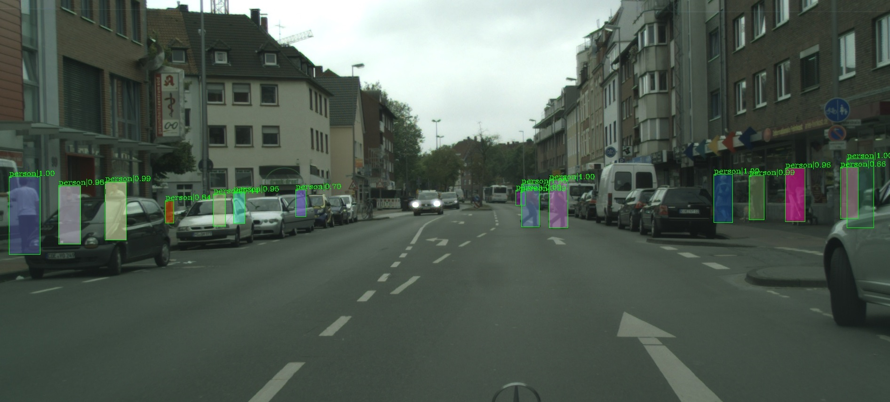

# **Updates**
* Added pre-trained models for Caltech, CityPersons and EuroCity Persons
* Added some qualitative results for Caltech on [YouTube](https://www.youtube.com/watch?v=cemN7JbgxWE&feature=youtu.be)
* Added demo script to perform inference using pre-trained models on some images
* Added testing and training scripts for all datasets.
* **Added configurations for Faster R-CNN along with pre-trained model**
* **Added configurations for RetinaNet along with pre-trained model**


# Pedestron

 

[Pedestron](https://128.84.21.199/pdf/2003.08799.pdf) is a [MMetection](https://github.com/open-mmlab/mmdetection) based repository that focuses on the advancement of research on pedestrian detection.
We provide processed annotations and scripts to process the annotation of different pedestrian detection benchmarks.

# YouTube
* YouTube [link](https://www.youtube.com/watch?v=cemN7JbgxWE&feature=youtu.be)  for qualitative results on Caltech. Pre-Trained model available.

### Installation
We refer to the installation and list of dependencies to [installation](https://github.com/hasanirtiza/Pedestron/blob/master/INSTALL.md) file.
Clone this repo and follow [installation](https://github.com/hasanirtiza/Pedestron/blob/master/INSTALL.md).

### List of detectors
Currently We provide configurations for
* Cascade Mask-R-CNN
* Faster R-CNN  


### Following datasets are currently supported 
* [Caltech](http://www.vision.caltech.edu/Image_Datasets/CaltechPedestrians/)
* [CityPersons](https://bitbucket.org/shanshanzhang/citypersons/src/default/)
* [EuroCity Persons](https://eurocity-dataset.tudelft.nl/)
* [CrowdHuman](https://www.crowdhuman.org/)
* [WiderPedestrian Challenge](https://competitions.codalab.org/competitions/20132)


### Datasets Preparation
* We refer to [Datasets preparation file](Datasets-PreProcessing.md) for detailed instructions


### Benchmarking of Pre-Trained models
|    Detector                | Dataset   | Reasonable  | Heavy    | 
|--------------------|:--------:|:--------:|:--------:|
| [Cascade Mask R-CNN](https://drive.google.com/open?id=1B487ljaU9FxTSFaLoirOSqadZ-39QEH8) | CityPersons        | 7.5        |   28.0      | 
| [Faster R-CNN](https://drive.google.com/open?id=1aanqAEFBc_KGU8oCFCji-wqmLmqTd749) | CityPersons        | 10.3        |   33.07      |
| [RetinaNet](https://drive.google.com/open?id=1MGxZitqLzQtd2EF8cVGYNzSKt73s9RYY) | CityPersons        | 14.6        |   39.5      | 
| [Cascade Mask R-CNN](https://drive.google.com/open?id=1HkoUPlONSF04AKsPkde4gmDLMBf_vrnv) | Caltech        |   1.7      |    25.7     | 
| [Cascade Mask R-CNN](https://drive.google.com/open?id=1GzB3O1JxPN5EusJSyl7rl9h0sQAVKf15) | EuroCity Persons |    4.4     |  21.3       | 
 

### Pre-Trained models
Cascade Mask R-CNN
1) [CityPersons](https://drive.google.com/open?id=1B487ljaU9FxTSFaLoirOSqadZ-39QEH8)
2) [Caltech](https://drive.google.com/open?id=1HkoUPlONSF04AKsPkde4gmDLMBf_vrnv)
3) [EuroCity Persons](https://drive.google.com/open?id=1GzB3O1JxPN5EusJSyl7rl9h0sQAVKf15)

Faster R-CNN
1) [CityPersons](https://drive.google.com/open?id=1aanqAEFBc_KGU8oCFCji-wqmLmqTd749)

### Running a demo using pre-trained model on few images
1) Pre-trained model can be evaluated on sample images in the following way

```shell 
python tools/demo.py config checkpoint input_dir output_dir
```
Download one of our provided pre-trained model and place it in  models_pretrained folder. Demo can be run using the following command

```shell 
python tools/demo.py configs/elephant/cityperson/cascade_hrnet.py ./models_pretrained/epoch_5.pth.stu demo/ result_demo/ 
```


### Training
Train with single GPU

```shell
python tools/train.py ${CONFIG_FILE}
```

Train with multiple GPUs
```shell
./tools/dist_train.sh ${CONFIG_FILE} ${GPU_NUM} [optional arguments]
```

For instance training on CityPersons using single GPU 

```shell
python tools/train.py configs/elephant/cityperson/cascade_hrnet.py
```

Training on CityPersons using multiple(7 in this case) GPUs 
```shell
./tools/dist_train.sh configs/elephant/cityperson/cascade_hrnet.py 7  
```

### Testing

Test can be run using the following command.
 
```shell 
python ./tools/TEST_SCRIPT_TO_RUN.py PATH_TO_CONFIG_FILE ./models_pretrained/epoch_ start end\
 --out Output_filename --mean_teacher 
``` 

For example for CityPersons inference can be done the following way

1) Download the pretrained [CityPersons](https://drive.google.com/open?id=1B487ljaU9FxTSFaLoirOSqadZ-39QEH8) model and place it in the folder "models_pretrained/".
2) Run the following command:

```shell 
python ./tools/test_city_person.py configs/elephant/cityperson/cascade_hrnet.py ./models_pretrained/epoch_ 5 6\
 --out result_citypersons.json --mean_teacher 
```
* Similarly change respective paths for EuroCity Persons
* For Caltech refer to [Datasets preparation file](Datasets-PreProcessing.md)

### Please cite the following work
[ArXiv version](https://128.84.21.199/pdf/2003.08799.pdf)
```
@article{hasan2020pedestrian,
  title={Pedestrian Detection: The Elephant In The Room},
  author={Hasan, Irtiza and Liao, Shengcai and Li, Jinpeng and Akram, Saad Ullah and Shao, Ling},
  journal={arXiv preprint arXiv:2003.08799},
  year={2020}
}
```
