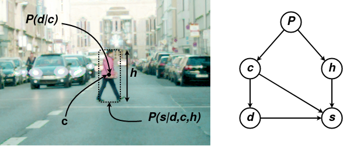

# F2DNet

F2DNet is a [Pedestron](https://github.com/hasanirtiza/Pedestron) based repository which implements a novel, two-staged detector i.e. Fast Focal Detection Network for pedestrian detection.

 

### Installation
Please refer to base repository for step-by-step installation. 

### List of detectors

In addition to configuration for different detectors provided in base repository we provide configuration for F2DNet.

### Following datasets are currently supported 
* [Caltech](http://www.vision.caltech.edu/Image_Datasets/CaltechPedestrians/)
* [CityPersons](https://github.com/cvgroup-njust/CityPersons)
* [EuroCity Persons](https://eurocity-dataset.tudelft.nl/)

### Datasets Preparation
Please refer to base repository for dataset preparation.

# Benchmarking 
### Benchmarking of F2DNet on pedestrian detection datasets
| Dataset            | Reasonable | Small | Heavy | 
|--------------------|:----------:|:-----:|:-----:|
| CityPersons        |    **8.7**     | **11.3**  | **32.6**  | 
| EuroCityPersons    |    **6.1**     | **10.7**  | **28.2**  | 
| Caltech Pedestrian |    **2.2**     |  **2.5**  | **38.7**  |

### Benchmarking of F2DNet model on pedestrian detection datasets using extra data
| Dataset            | Reasonable | Small | Heavy | 
|--------------------|:----------:|:-----:|:-----:|
| CityPersons        |    7.8     |  9.4  | **26.2**  |
| Caltech Pedestrian |    **1.7**     |  **2.1**  | **20.4**  |

# References
* [Pedestron](https://openaccess.thecvf.com/content/CVPR2021/papers/Hasan_Generalizable_Pedestrian_Detection_The_Elephant_in_the_Room_CVPR_2021_paper.pdf)
