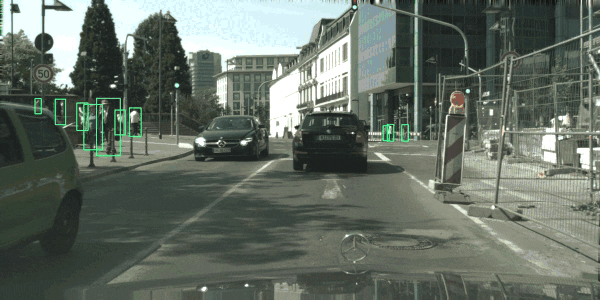
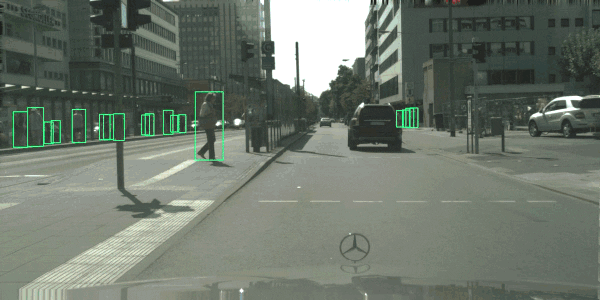
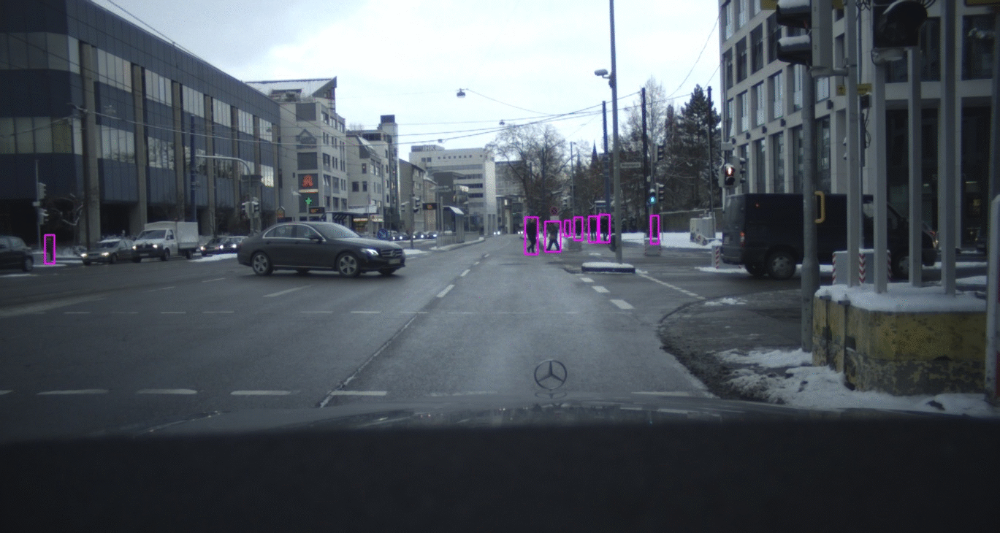

[](https://paperswithcode.com/sota/pedestrian-detection-on-citypersons?p=pedestrian-detection-the-elephant-in-the-room)

[](https://paperswithcode.com/sota/pedestrian-detection-on-caltech?p=pedestrian-detection-the-elephant-in-the-room)


# Pedestron
 
 


[Pedestron](https://128.84.21.199/pdf/2003.08799.pdf) is a [MMdetection](https://github.com/open-mmlab/mmdetection) based repository, that focuses on the advancement of research on pedestrian detection. We provide a list of detectors, both general purpose and pedestrian specific to train and test. Moreover, we provide pre-trained models and benchmarking of several detectors on different pedestrian detection datasets. Additionally, we provide processed annotations and scripts to process the annotation of different pedestrian detection benchmarks. If you use Pedestron, please cite us (see at the end) and other respective sources.

# :fire: **Updates** :fire:
* :fire: **We haved added a slightly better implementation of [CSP - CVPR 2019](https://openaccess.thecvf.com/content_CVPR_2019/papers/Liu_High-Level_Semantic_Feature_Detection_A_New_Perspective_for_Pedestrian_Detection_CVPR_2019_paper.pdf) to Pedestron along with a pre-trained model.** :fire:


### YouTube demo
* [Caltech](https://www.youtube.com/watch?v=cemN7JbgxWE&feature=youtu.be) and [EuroCity Persons](https://www.youtube.com/watch?v=ZFObRPa_yMM). Pre-Trained model available.

### Leaderboards 
* [CityPersons](https://github.com/cvgroup-njust/CityPersons)
* [EuroCity Persons](https://eurocity-dataset.tudelft.nl/eval/benchmarks/detection)

### Installation
We refer to the installation and list of dependencies to [installation](https://github.com/hasanirtiza/Pedestron/blob/master/INSTALL.md) file.
Clone this repo and follow [installation](https://github.com/hasanirtiza/Pedestron/blob/master/INSTALL.md). Alternatively, [Google Colab](https://github.com/hasanirtiza/Pedestron/blob/master/colab/PedestronColab.ipynb) step-by-step instruction can be followed for installation (Please download the pre-trained models from the table in the readme.md, the link is broken on google colab for the pre-trained model). Addiitonally, you can also refer to the [google doc](https://docs.google.com/document/d/1cmFuGJvb1PQzJwAj7WDBUy-CEepIqpUE7WCY2dXbfKQ/edit) file for step-by-step installation. For running a [docker image](https://github.com/hasanirtiza/Pedestron/blob/master/INSTALL.md#docker-installation) please see installation file.

### List of detectors
Currently we provide configurations for the following detectors, with different backbones
* Cascade Mask-R-CNN
* Faster R-CNN
* RetinaNet
* RetinaNet with Guided Anchoring
* Hybrid Task Cascade (HTC)  
* MGAN
* CSP 


### Following datasets are currently supported 
* [Caltech](http://www.vision.caltech.edu/Image_Datasets/CaltechPedestrians/)
* [CityPersons](https://github.com/cvgroup-njust/CityPersons)
* [EuroCity Persons](https://eurocity-dataset.tudelft.nl/)
* [CrowdHuman](https://www.crowdhuman.org/)
* [WiderPedestrian Challenge](https://competitions.codalab.org/competitions/20132)


### Datasets Preparation
* We refer to [Datasets preparation file](Datasets-PreProcessing.md) for detailed instructions


# Benchmarking 

### Benchmarking of pre-trained models on pedestrian detection datasets (autonomous driving)
|    Detector                | Dataset   | Backbone| Reasonable  | Heavy    | 
|--------------------|:--------:|:--------:|:--------:|:--------:|
| [Cascade Mask R-CNN](https://drive.google.com/file/d/12mWjmWBv-4wra8hCNF71Wq0U2va0Ai8e/view?usp=sharing) | CityPersons        | HRNet | 7.5        |   28.0      | 
| [Cascade Mask R-CNN](https://drive.google.com/file/d/1u2YTq1ttK1Nn-XWA0TbTjyerq7-LH_EE/view?usp=sharing) | CityPersons        | MobileNet | 10.2        |   37.3      | 
| Faster R-CNN | CityPersons        | HRNet | 10.2        |   36.2      |
| RetinaNet | CityPersons        | ResNeXt | 14.6        |   39.5      |
| RetinaNet with Guided Anchoring | CityPersons        | ResNeXt | 11.7        |   41.5      |
| Hybrid Task Cascade (HTC) | CityPersons        | ResNeXt | 9.5       |   35.8      | 
| [MGAN](https://drive.google.com/file/d/1vcB4PrS0Vpo48f27QpGtJPWo9iwGs5Vl/view?usp=sharing) | CityPersons        | VGG | 11.2       |   52.5      |
| [CSP](https://drive.google.com/file/d/14qpoyQWIirzUyLZHTxjZe-09AxiUtIxK/view?usp=sharing) | CityPersons        | ResNet-50 | 10.9       |   41.3      | 
| [Cascade Mask R-CNN](https://drive.google.com/file/d/12J5z4G48LIgv2w74VvH6jz-Z2095SIDU/view?usp=sharing) | Caltech        | HRNet |   1.7      |    25.7     | 
| [Cascade Mask R-CNN](https://drive.google.com/file/d/1Hu0VzsN_RAfQzP9K5UfwrqJcV14ZzTD1/view?usp=sharing) | EuroCity Persons | HRNet |    4.4     |  21.3       |
| Faster R-CNN | EuroCity Persons        | HRNet | 6.1        |   27.0      |
 
 
### Benchmarking of pre-trained models on general human/person detection datasets
 
 |    Detector                | Dataset   | Backbone| AP  |
 |--------------------|:--------:|:--------:|:--------:|
 |    [Cascade Mask R-CNN](https://drive.google.com/file/d/1Nsvf7qU02fvRdTO2jcKo5Rgr5JOV3Ptx/view?usp=sharing) | CrowdHuman   | HRNet| 84.1  |

# Getting Started

### Running a demo using pre-trained model on few images

Pre-trained model can be evaluated on sample images in the following way

```shell 
python tools/demo.py config checkpoint input_dir output_dir
```
Download one of our provided pre-trained model and place it in  models_pretrained folder. Demo can be run using the following command

```shell 
python tools/demo.py configs/elephant/cityperson/cascade_hrnet.py ./models_pretrained/epoch_5.pth.stu demo/ result_demo/ 
```

See [Google Colab demo](https://github.com/hasanirtiza/Pedestron/blob/master/colab/PedestronColab.ipynb). 


### Training

- [x] single GPU training
- [x] multiple GPU training

Train with single GPU

```shell
python tools/train.py ${CONFIG_FILE}
```

Train with multiple GPUs
```shell
./tools/dist_train.sh ${CONFIG_FILE} ${GPU_NUM} [optional arguments]
```

For instance training on CityPersons using single GPU 

```shell
python tools/train.py configs/elephant/cityperson/cascade_hrnet.py
```

Training on CityPersons using multiple(7 in this case) GPUs 
```shell
./tools/dist_train.sh configs/elephant/cityperson/cascade_hrnet.py 7  
```

### Testing

- [x] single GPU testing
- [x] multiple GPU testing

Test can be run using the following command.
 
```shell 
python ./tools/TEST_SCRIPT_TO_RUN.py PATH_TO_CONFIG_FILE ./models_pretrained/epoch_ start end\
 --out Output_filename --mean_teacher 
``` 

For example for CityPersons inference can be done the following way

1) Download the pretrained [CityPersons](https://drive.google.com/open?id=1B487ljaU9FxTSFaLoirOSqadZ-39QEH8) model and place it in the folder "models_pretrained/".
2) Run the following command:

```shell 
python ./tools/test_city_person.py configs/elephant/cityperson/cascade_hrnet.py ./models_pretrained/epoch_ 5 6\
 --out result_citypersons.json --mean_teacher 
```
Alternatively, for EuroCity Persons

```shell
python ./tools/test_euroCity.py configs/elephant/eurocity/cascade_hrnet.py ./models_pretrained/epoch_ 147 148 --mean_teacher
```

or without mean_teacher flag for MGAN

```shell 
python ./tools/test_city_person.py configs/elephant/cityperson/mgan_vgg.py ./models_pretrained/epoch_ 1 2\
 --out result_citypersons.json  
```

Testing with multiple GPUs on CrowdHuman

```shell
./tools/dist_test.sh ${CONFIG_FILE} ${CHECKPOINT_FILE} ${GPU_NUM} [--out ${RESULT_FILE}] [--eval ${EVAL_METRICS}]
```

```shell
./tools/dist_test.sh configs/elephant/crowdhuman/cascade_hrnet.py ./models_pretrained/epoch_19.pth.stu 8 --out CrowdHuman12.pkl --eval bbox
```

* Similarly change respective paths for EuroCity Persons
* For Caltech refer to [Datasets preparation file](Datasets-PreProcessing.md)

### Please cite the following work
[CVPR2021](https://openaccess.thecvf.com/content/CVPR2021/papers/Hasan_Generalizable_Pedestrian_Detection_The_Elephant_in_the_Room_CVPR_2021_paper.pdf)
```
@InProceedings{Hasan_2021_CVPR,
    author    = {Hasan, Irtiza and Liao, Shengcai and Li, Jinpeng and Akram, Saad Ullah and Shao, Ling},
    title     = {Generalizable Pedestrian Detection: The Elephant in the Room},
    booktitle = {Proceedings of the IEEE/CVF Conference on Computer Vision and Pattern Recognition (CVPR)},
    month     = {June},
    year      = {2021},
    pages     = {11328-11337}
}
```
